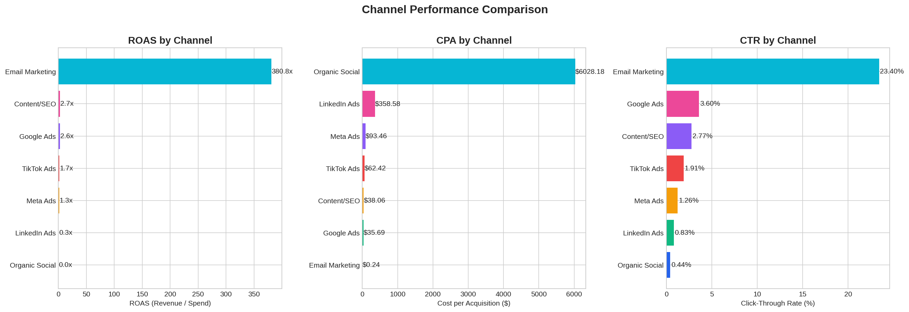
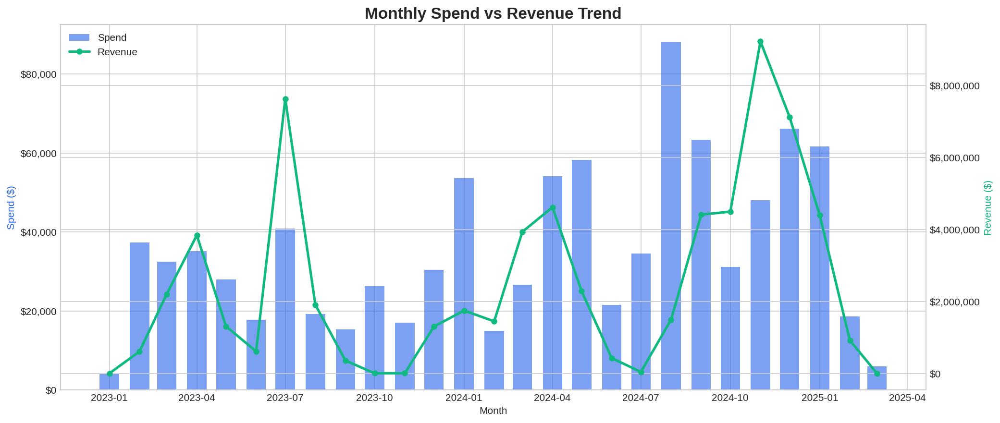
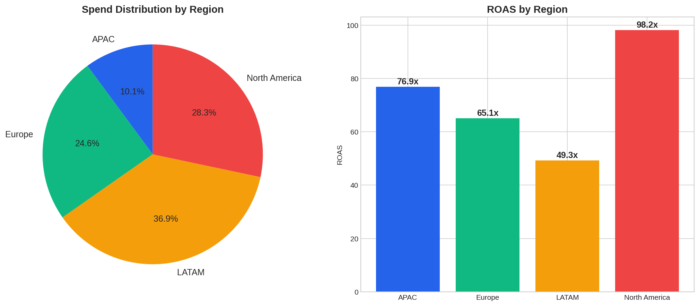
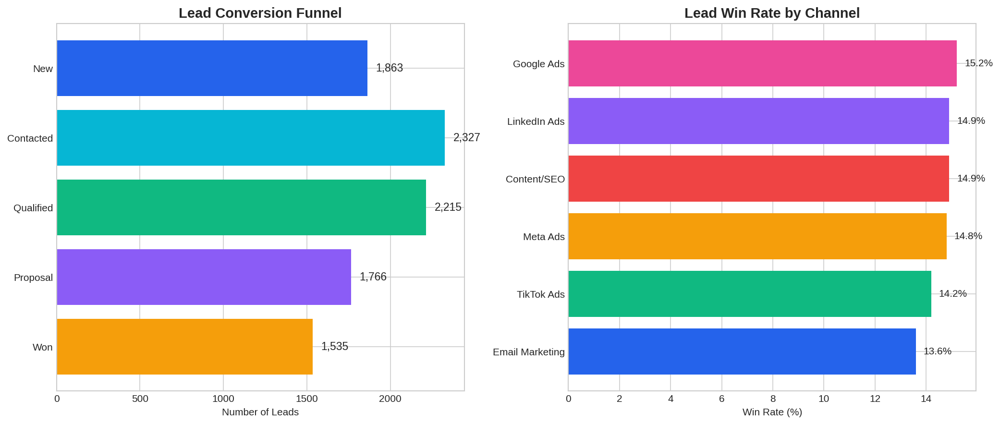
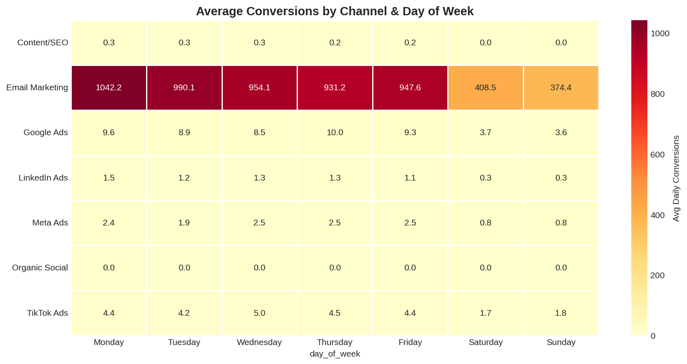
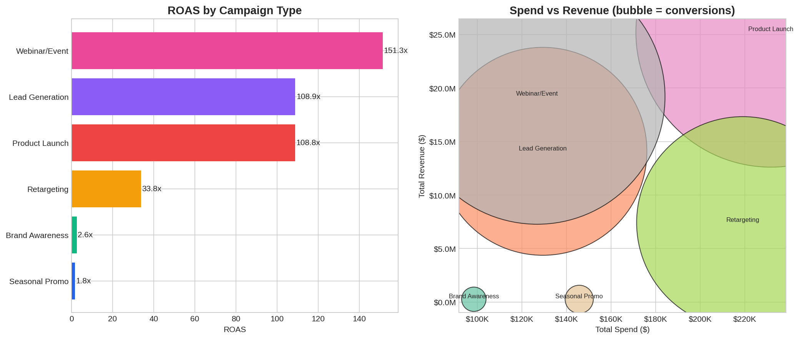

# 📊 Marketing Campaign Analytics | Business Intelligence Project

> End-to-end analysis of a SaaS company's multi-channel marketing campaigns. From raw data to actionable insights with Python ETL pipeline, exploratory analysis, and Power BI dashboard.


---

## 🎯 Business Problem

A mid-size SaaS company runs marketing campaigns across **7 channels** (Google Ads, Meta, LinkedIn, Email, TikTok, Organic Social, Content/SEO) targeting **4 regions** (LATAM, North America, Europe, APAC). The marketing team needs answers to:

1. **Which channels deliver the best return on ad spend (ROAS)?**
2. **How should budget be reallocated to maximize conversions?**
3. **What's the lead funnel efficiency by channel and region?**
4. **Are there seasonal or day-of-week patterns to exploit?**
5. **Which campaign types generate the highest quality leads?**

## 📁 Project Structure

```
marketing-analytics/
├── data/
│   ├── raw/                          # Original generated datasets
│   │   ├── campaigns.csv
│   │   ├── daily_performance.csv
│   │   └── leads.csv
│   └── processed/                    # Clean, transformed tables
│       ├── dim_campaigns.csv         # Campaign dimension
│       ├── dim_dates.csv             # Date dimension (star schema)
│       ├── fact_daily_performance.csv # Daily metrics fact table
│       ├── fact_leads.csv            # Lead-level fact table
│       ├── agg_monthly_channel.csv   # Monthly aggregations
│       ├── agg_campaign_performance.csv
│       ├── agg_lead_funnel.csv
│       └── marketing_analytics_data.xlsx  # All-in-one for Power BI
├── scripts/
│   ├── 01_generate_data.py           # Realistic data generation
│   ├── 02_etl_pipeline.py            # Extract, Transform, Load
│   └── 03_eda_analysis.py            # Exploratory Data Analysis
├── dashboards/
│   └── marketing_dashboard.pbix      # Power BI dashboard
├── docs/
│   └── figures/                      # EDA visualizations
├── requirements.txt
└── README.md
```

## 🔧 Tech Stack

| Tool | Purpose |
|------|---------|
| **Python 3.10+** | ETL pipeline, data generation, analysis |
| **Pandas / NumPy** | Data manipulation and transformation |
| **Matplotlib / Seaborn** | Statistical visualizations |
| **Power BI** | Interactive dashboard |
| **Git / GitHub** | Version control |

## 🔄 ETL Pipeline

The pipeline (`02_etl_pipeline.py`) follows a structured Extract → Transform → Load process:

**Extract:** Reads 3 raw CSV files (campaigns, daily performance, leads).

**Transform:**
- Data type casting and validation
- Null handling and negative value correction
- KPI computation: CTR, CPC, CPA, ROAS, conversion rate, CPM
- Time dimension enrichment (quarter, day of week, weekend flag)
- Lead scoring model and deal size categorization
- Budget tier classification
- Date dimension table for star schema modeling

**Load:** Outputs 7 analysis-ready tables (CSV + consolidated Excel workbook).

### Data Model (Star Schema)

```
        dim_campaigns ─────┐
                           │
        dim_dates ─────────┼──── fact_daily_performance
                           │
                           └──── fact_leads
```

## 📈 Key Findings

### Channel Performance
- **Email Marketing** delivers the highest ROAS, making it the most cost-efficient channel
- **LinkedIn Ads** shows the highest conversion rate (5.2%) despite a higher CPC — strong for B2B lead quality
- **TikTok Ads** has the lowest CPA but also lower lead quality (lower win rate)

### Regional Insights
- **North America** generates the highest revenue per conversion
- **LATAM** receives ~30% of spend with competitive ROAS — growth opportunity

### Lead Funnel
- Overall win rate: **14.3%** across all channels
- Average deal value for won leads: **$7,718**
- LinkedIn leads convert to "Won" at a higher rate than any other paid channel

### Temporal Patterns
- Weekdays consistently outperform weekends for B2B conversions
- Q4 shows seasonal uplift across all channels (holiday/budget-flush effect)

## 📊 Visualizations

### Channel Performance Comparison


### Monthly Spend vs Revenue Trend


### Regional Analysis


### Lead Conversion Funnel


### Day-of-Week Heatmap


### Campaign Type Efficiency


## 🖥️ Power BI Dashboard

The interactive dashboard includes:
- **Executive Summary** — KPI cards (total spend, revenue, ROAS, leads, win rate)
- **Channel Deep Dive** — Performance comparison with drill-through
- **Regional View** — Map visualization with regional KPIs
- **Lead Funnel** — Interactive funnel with filtering by channel/region
- **Trend Analysis** — Time series with forecast

> 📌 To use: Open `dashboards/marketing_dashboard.pbix` in Power BI Desktop and connect to `data/processed/marketing_analytics_data.xlsx`

## 🚀 How to Run

```bash
# Clone the repository
git clone https://github.com/federicogiglio/marketing-analytics.git
cd marketing-analytics

# Install dependencies
pip install -r requirements.txt

# Generate data
python scripts/01_generate_data.py

# Run ETL pipeline
python scripts/02_etl_pipeline.py

# Run exploratory analysis
python scripts/03_eda_analysis.py
```

## 📌 Recommendations (Based on Analysis)

1. **Increase Email Marketing budget** — Highest ROAS with lowest CPA. Quick win.
2. **Scale LinkedIn for enterprise leads** — Higher CPC but best lead quality and win rate.
3. **Reduce TikTok spend or reposition** — Low CPA but poor funnel conversion.
4. **Shift weekend budget to weekdays** — Consistent B2B pattern across all channels.
5. **Invest more in LATAM** — Competitive ROAS with room for growth.

## 👤 Author

**Federico Giglio**
- 📍 Buenos Aires, Argentina
- 🎓 Diploma in Data Science (UTN)
- 💼 Aspiring Data/BI Analyst

[](https://linkedin.com/in/TU-LINKEDIN)

## 📄 License

This project is licensed under the MIT License.
